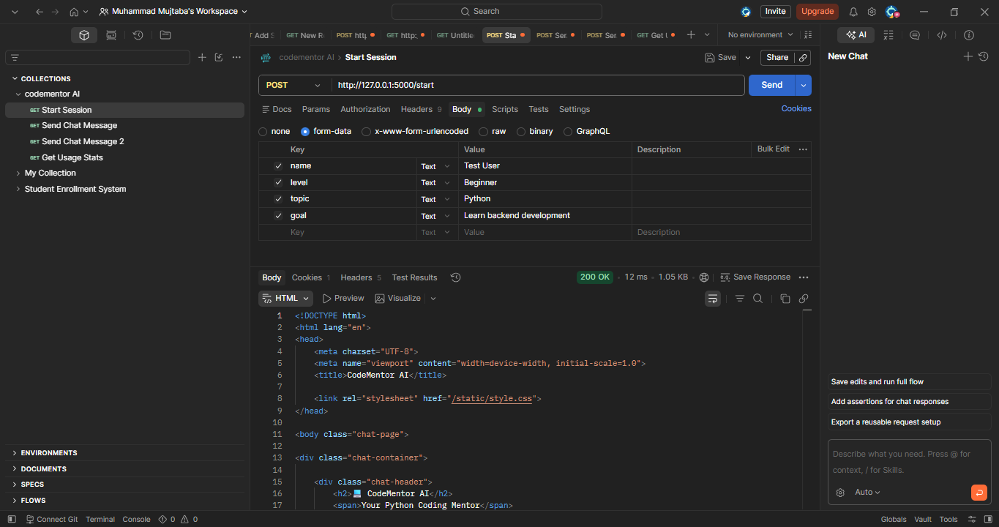
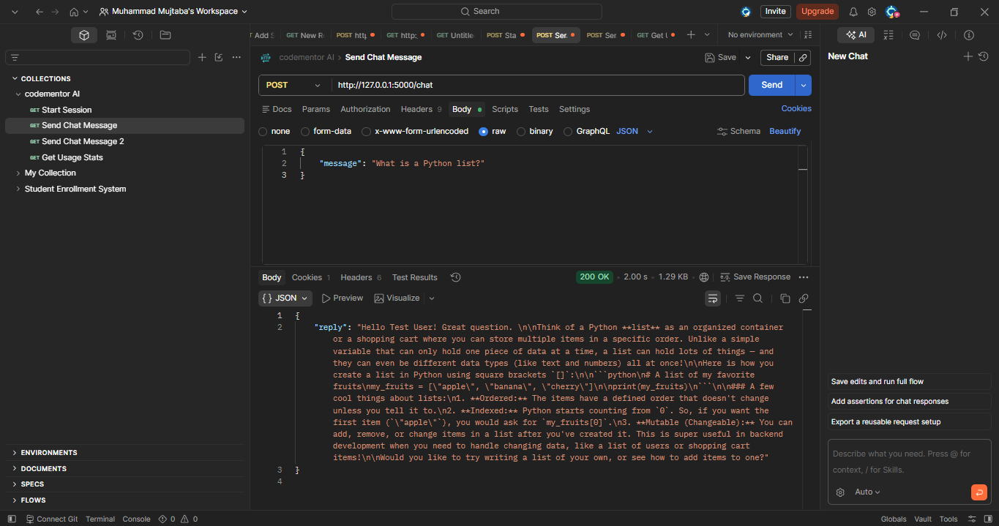
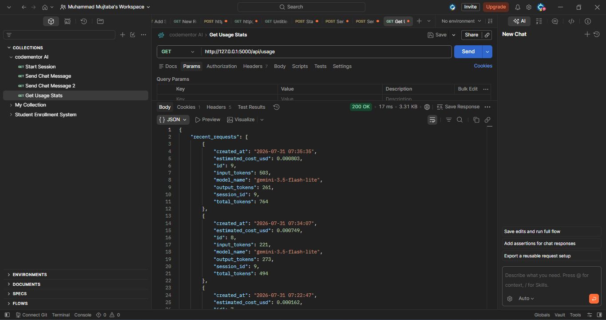

# CodeMentor AI

A domain-bounded AI coding mentor built with Flask and the Gemini API. CodeMentor AI helps users learn Python programming through a hardened, role-locked chatbot — it will only answer Python-related questions and redirects anything outside that domain.

Built as part of the SMIT GenAI Course assignment: *Domain-Bounded AI Assistant with Persistent History & Cost Dashboard*.

## Domain Chosen

**Coding Mentor for Python** — onboarding collects the user's name, experience level (Beginner/Intermediate/Advanced), current topic they're focused on, and their learning goal. The bot then acts strictly as a Python tutor for the rest of the session.

## System Prompt Strategy

The system prompt is **not static** — it's built dynamically at the start of every chat request using the onboarding data stored in the `Sessions` table (see `prompts.py` → `build_system_prompt()`). This means:

- The prompt includes the user's actual name, experience level, topic, and goal, so responses are personalized to that specific user.
- It hardens the bot's role with explicit rules: only answer Python/programming questions, and politely decline + redirect anything off-topic (general knowledge, medical, financial, personal advice, etc.).
- The system instruction is passed separately from the conversation `contents` using Gemini's `system_instruction` config parameter — it is never mixed into the user's message text. This keeps the "system vs user prompt" separation clean, as covered in Lecture 18.

## Multi-Turn Conversation Handling

On every `/chat` request:
1. The incoming user message is saved to the `Messages` table immediately.
2. All previous messages for that session are pulled from the database, ordered by creation time.
3. That full history is converted into Gemini's expected `contents` format (alternating `user`/`model` roles) and sent with every single API call — not just the latest message.
4. The assistant's reply is saved back to `Messages` after the call completes.

This avoids the "flat token count" trap: because full history is resent each turn, `input_tokens` genuinely grows as the conversation progresses, which is visible on the dashboard.

## Database Schema (SQLite via Flask-SQLAlchemy)

**Sessions**
| Field | Type | Notes |
|---|---|---|
| id | Integer PK | |
| user_name | String | From onboarding form |
| onboarding_data | Text (JSON) | Stores level, topic, goal as a JSON blob |
| created_at | DateTime | |

**Messages**
| Field | Type | Notes |
|---|---|---|
| id | Integer PK | |
| session_id | Integer FK → Sessions.id | |
| role | String | `user` or `assistant` |
| content | Text | The message text |
| created_at | DateTime | |

**UsageLogs**
| Field | Type | Notes |
|---|---|---|
| id | Integer PK | |
| session_id | Integer FK → Sessions.id | |
| message_id | Integer FK → Messages.id, nullable | Links to the assistant reply this cost belongs to |
| input_tokens | Integer | From `usage_metadata.prompt_token_count` |
| output_tokens | Integer | From `usage_metadata.candidates_token_count` |
| total_tokens | Integer | From `usage_metadata.total_token_count` |
| estimated_cost_usd | Float | Computed — see pricing below |
| model_name | String | Which Gemini model handled the call |
| created_at | DateTime | |

One `UsageLog` row is created **per API call**, not per message pair — matching the spec exactly.

## Model & Pricing

**Model used:** `gemini-3.5-flash-lite`

Gemini 2.5-series models (flash, flash-lite, pro) are no longer available to newly created API keys as of mid-2026 — Google now routes new users to the Gemini 3.x family. `gemini-3.5-flash-lite` was chosen because it is a stable (GA) model with an active free tier and the lowest cost among current-generation models.

**Pricing rates used (Standard tier, text):**
- Input: **$0.30 per 1,000,000 tokens**
- Output: **$2.50 per 1,000,000 tokens**

**Source:** [https://ai.google.dev/gemini-api/docs/pricing](https://ai.google.dev/gemini-api/docs/pricing) — checked July 31, 2026.

**Cost formula used** (`app.py`):
```python
cost = (input_tokens / 1_000_000 * INPUT_RATE_PER_MILLION) + \
       (output_tokens / 1_000_000 * OUTPUT_RATE_PER_MILLION)
```

Token counts are read directly from Gemini's `response.usage_metadata` on every call — never hardcoded or estimated.

## Architecture

**Backend (Flask)**
- `/` — onboarding form (GET)
- `/start` — creates a Session record from onboarding data (POST)
- `/chat` — renders chat UI (GET) and handles messages (POST)
- `/dashboard` — renders the usage dashboard (GET)
- `/api/usage` — JSON endpoint with totals, per-session breakdown, and recent request logs (GET)

**Frontend**
- Plain HTML/CSS/JS — no frameworks
- Chat page uses `fetch()` to send/receive messages without a page reload
- Dashboard page uses `fetch()` to pull `/api/usage` and render tables/stats client-side

## How to Run Locally

1. Clone the repo and open the folder
2. Create and activate a virtual environment:
```bash
   python -m venv .venv
   .venv\Scripts\activate   # Windows
```
3. Install dependencies:
```bash
   pip install -r requirements.txt
```
4. Copy `.env.example` to `.env` and add your own Gemini API key: REMOVED

5. Run the app:
```bash
   python app.py
```
6. Open `http://127.0.0.1:5000/` in your browser

## Postman Testing

A Postman collection (`CodeMentor AI.postman_collection.json`) is included in this repo, covering:
- Starting a session (`/start`)
- Sending chat messages (`/chat`)
- Fetching usage/cost data (`/api/usage`)

### Screenshots

**1. Starting a session**


**2. Sending a chat message**


**3. Usage/cost tracking (token & cost fields populated)**


## Off-Domain Refusal

The bot refuses to answer anything outside Python/programming (e.g. general knowledge questions) and redirects the user back to Python topics, per the hardened system prompt.